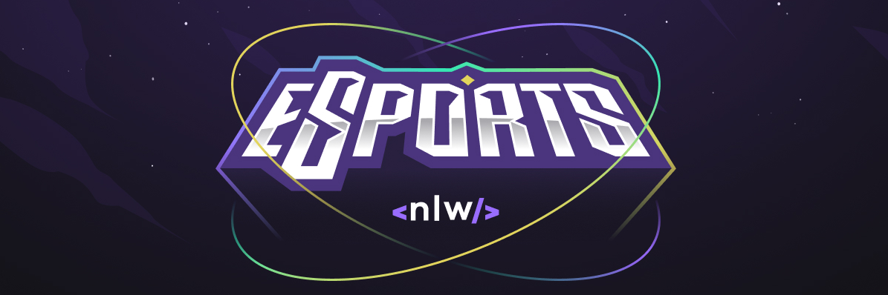
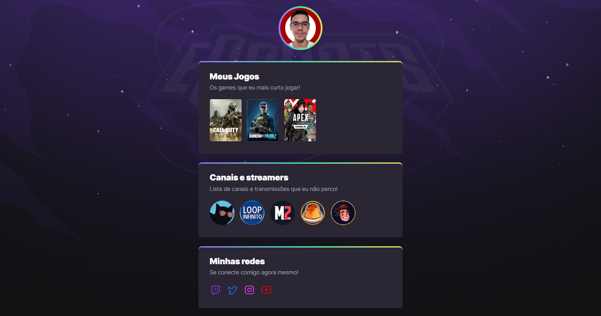

    

<h1 align="center">
    NLW eSports
</h1>

<h4 align="center">
  Aplicação web desenvolvida durante o evento Next Level Week(NLW) edição eSports, basicamente é um Game Hub, onde exibimos os jogos que gostamos, streamers que assistimos e nossas redes soaciais.
</h4>

    <a href="#🔗-deploy">Demonstração</a>&nbsp;&nbsp;&nbsp;|&nbsp;&nbsp;&nbsp;
    <a href="#🔨-tecnologias">Tecnologias</a>&nbsp;&nbsp;&nbsp;|&nbsp;&nbsp;&nbsp;
    <a href="#💡-features">Features</a>&nbsp;&nbsp;&nbsp;|&nbsp;&nbsp;&nbsp;
    <a href="#📝-licença">Licença</a>

 

### [🔗 Deploy](https://mateuss18.github.io/NLW_eSports-Explorer/)

>
---

## 🔨 Tecnologias

  
  

>
---
## 💡 Features

- Responsivo
- Animações

---

## 📝 Licença   

Esse projeto está sob a licença MIT. Veja o arquivo [LICENSE](LICENSE) para mais detalhes.

---

Feito por Mateus Lopes :D ❤   

